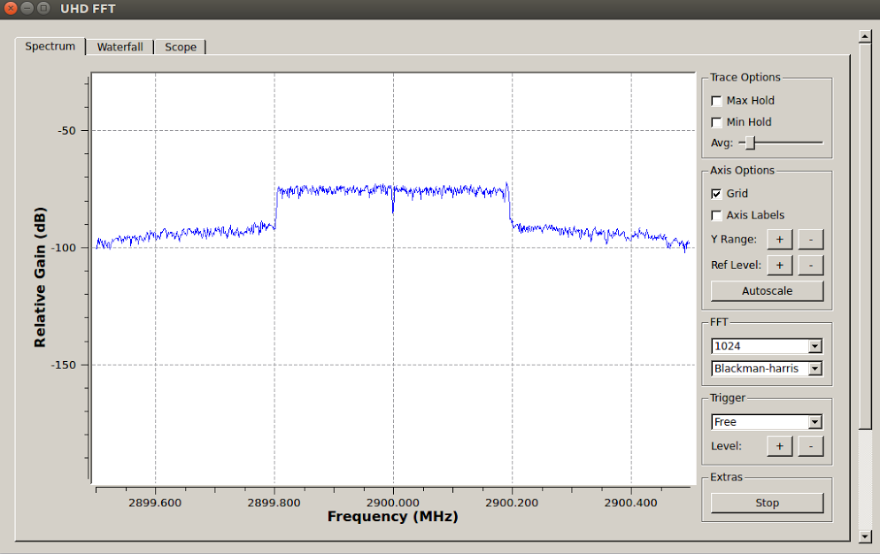

# WiSHFUL GNURadio example tutorial #

For any information or issue, please contact Maicon Kist at kistm@tcd.ie

## Before you start

We assume that the person following this tutorial has familiarity with the Unix command line (specially the networking tools, such as **ifconfig**) and with a command line text editor (such as vim or nano).

## Goal of this experiment

The goal of this experiment is to create an example tutorial for the WiSHFUL framework and the UPI functions usage that
run on GNURadio platform.
Specifically, this experiment uses the WiSHFUL framework and the UPI functions to set-up a GNURadio TX/RX pair and change parameters. All the UPI functions used in this example are fully documented in https://wishful-project.github.io/wishful_upis/

We want to demonstrate how the WISHFUL UPI can be exploited to:
*i*) Set up two GNURadio waveforms, an OFDM TX and a OFDM RX;
*ii*) Show the use of UPI_R to monitor nodes parameters;
*iii*) Show the use of UPI_R functions to tune the node's parameters.

# Getting Started

## 1. Reserving the VM's

Reserve ***three WiSHFUL nodes*** in the ***IRIS Testbed*** by using the JFED reservation.

These VMs are used as follows:
(*i*) one VM to run the the Controller program, or WiSHFUL Controller;
(*ii*) one VM to run the TX;
(*iii*) one VM to run the RX.

### The WiSHFUL controller node

The controller is implemented in ```wishful_simple_controller```

The WiSHFUL Controller permits to: (*i*) discovery of agent nodes, (*ii*) installation of GNURadio waveforms on the agents, (*iii*) monitor values from the GNURadio waveform, and (*iv*) configure parameters on the GNURadio waveform.

Also, the WiSHFUL controller executes the logic
for controlling the experiment, where we distinguish three phases: (*i*) we wait for all agent nodes to connect to the WiSHFUL controller, (*ii*) set up the corresponding waveforms in each agent, and (*iii*) monitor/configure parameters on the GNURadio waveforms.

### The WiSHFUL agents

The two agents that we will use in this example don't implement any specific functionality. Their sole purpose in this experiment is to connect to the WiSHFUL controller and wait for instructions (passed through UPI calls).

The agents are implemented in:
- ```agent_tx.py``` for the transmitter;
- ```agent_rx.py``` for the receiver

To better understand all the phases of this example tutorial and the single UPI function usage, we add
inline comment to both controller and agent programs.

## 2. Access WiSHFUL CONTROLLER
1. Open a shell in your computer.
2. Connect to controller PC (you can find the command in the reservation webpage):
    ```
    ssh -A -X -i your-private-key user@controller-vm-ip -oPort=22 -oProxyCommand='ssh -i path-to-your-private-key -oPort=22 user@134.226.55.214 -W %h:%p'
   ```
3. Move in the experiment directory
    ```
    cd /opt/wishful/examples/Get_Started_Examples/Simple_GNURadio_Example
    ```
4. Open ```wishful_simple_controller``` and change "controller-vm-ip" and "ethinterface" by the IP address and the Ethernet interface of the Iris testbed network (NOTE: much likely the IP starts with **192.168.*.* ** and the interface is **ens3**): 
    ```
    controller_PC_IP_address = "controller-vm-ip" 
    controller_PC_interface = "ethinterface"
    ```
5. Start controller
    ```
    chmod +x wishful_simple_controller
    ./wishful_simple_controller (#run with -v for debugging)
    ```

## 3. Access the TX agent
1. Open a shell in your computer (you should have two shells now)
2. Connect to agent TX PC
    ```
    ssh -A -X -i your-private-key user@tx-vm-ip -oPort=22 -oProxyCommand='ssh -i path-to-your-private-key -oPort=22 user@134.226.55.214 -W %h:%p'
   ```
3. Move in the experiment directory
    ```
    cd /opt/wishful/examples/Get_Started_Examples/Simple_GNURadio_Example
    ```
4. Open ```agent_tx.py``` and change the "ethernet_interface" by the Ethernet inferface connected in the Iris testbed internal network (NOTE: much likely the interface is **ens3**):
    ```
    agent_PC_interface = "ethernet_interface"
    ```
5. Start the TX agent
    ```
    chmod +x agent_tx
    ./agent_tx (#run with -v for debugging)
    ```
    
## 4. Access the RX agent
1. Open a shell in your computer (you should have three shells now)
2. Connect to controller PC 
    ```
    ssh -A -X -i your-private-key user@rx-vm-ip -oPort=22 -oProxyCommand='ssh -i path-to-your-private-key -oPort=22 user@134.226.55.214 -W %h:%p'
   ```
3. Move in the experiment directory:
    ```
    cd /opt/wishful/examples/Get_Started_Examples/Simple_GNURadio_Example
    ```
4. Open ```agent_rx.py``` and  change the "ethernet_interface" by the Ethernet inferface connected in the Iris testbed internal network (NOTE: much likely the interface is **ens3**):
    ```
    agent_PC_interface = "ethernet_interface"
    ```
5. Start the RX agent:
    ```
    chmod +x agent_rx
    ./agent_rx (#run with -v for debugging)
    ```

## 5. Check the output at the Controller terminal:

The expected output should be similar to:

```
-- Nodes connected: 0/2
New node appeared:
ID: a775faab-893a-4bc2-8763-5ba47ab5eaba
IP: 192.168.5.76
Name: tx
Info: Example tutorial Agent
Modules: {0: 'LocalControlModule', 1: 'PyreDiscoveryAgentModule', 2: 'GnuRadioModule'}
Module_Functions: {0: ['start_local_control_program', 'stop_local_control_program', 'send_msg_to_local_control_program'], 2: ['set_parameters', 'get_running_radio_program', 'activate_radio_program', 'get_parameters', 'deactivate_radio_program']}
Module_Generators: {}
Interfaces: {}
Iface_Modules: {}
Modules_without_iface: [0, 1, 2]
New node appeared:
ID: 6028afb5-8a37-4803-bef7-b17b1293a874
IP: 192.168.5.88
Name: rx
Info: Example tutorial Agent
Modules: {0: 'LocalControlModule', 1: 'PyreDiscoveryAgentModule', 2: 'GnuRadioModule'}
Module_Functions: {0: ['start_local_control_program', 'send_msg_to_local_control_program', 'stop_local_control_program'], 2: ['deactivate_radio_program', 'get_running_radio_program', 'activate_radio_program', 'get_parameters', 'set_parameters']}
Module_Generators: {}
Interfaces: {}
Iface_Modules: {}
Modules_without_iface: [0, 1, 2]
```

After all nodes connected you should see the WiSHFUL Controller printing the messages informing that the GNURadio programs are being installed on the agents:

```
All nodes connected. Starting GNURadio Simple Experiment
    - Starting program at TX Agent
    - Starting program at RX Agent
* Starting Main Loop.
```
After installing the programs, the controller starts its main loop. The main loop consist of 20 repetitions of the following steps:

 1. Change the gain of the TX.
 2. Get the RX rate (a.k.a throughput) and the RX signal level.
 3. Print the RX rate and signal level (NOTE: signal level is printed in log10 scale).

```
== ITERATION 1/20
- Changing TX parameters
     Changing gain from 10 to 0
- Getting RX values
     Rate:     6195.200000
     Signal Level:      -3.665950
== ITERATION 2/20
- Changing TX parameters
     Changing gain from 0 to 40
- Getting RX values
     Rate:     5128.956629
     Signal Level:      -3.335518
== ITERATION 3/20
- Changing TX parameters
     Changing gain from 40 to 0
- Getting RX values
     Rate:     4350.375942
     Signal Level:      -2.091735
.
.
.

```

After 10 iterations we change the center frequency of the transmitter to a frequency that the RX cannot receive anything. With this, we just want to demonstrate what happens with the RX rate and RX signal level.

```
== ITERATION 10/20
- Changing TX parameters
     Changing gain from 0 to 40
     Changing frequency to 2910000000.0
RX will not receive data from now on.
    The rate will maintain the last value monitored. Signal level will be very low
- Getting RX values
     Rate:     4060.423164
     Signal Level:      -3.170337
== ITERATION 11/20
- Changing TX parameters
     Changing gain from 40 to 0
- Getting RX values
     Rate:     4060.423164
     Signal Level:      -3.958464
== ITERATION 12/20
- Changing TX parameters
     Changing gain from 0 to 40
- Getting RX values
     Rate:     4060.423164
     Signal Level:      -4.165950
```

Note that rate does not change after the TX changes its center frequency. This happens because the RX flowgraph is 'stalled' at the OFDM demodulation block (all blocks after that do not process anything anymore). Thus, the block responsible for calculating the rate just informs the last value calculated. Notice also that the RX signal level is very low compared to the 10 first iterations.

After 20 iterations the controller stops the TX and RX GNURadio programs and exits. 
We highlight that although the GNURadio programs are stopped, the agents are still running. You can restart the WiSHFUL Controller again if you want.
```
Stopping TX
Stopping RX
Controller Exiting
```

## Visualizing the Spectrum

To see the spectrogram during the experiment, you can open a 4th terminal, connect to the VM acting as the Controller and type:

```
uhd_fft --freq 2.9e9
```

Remember to do this before starting the experiment. You should see something similar to this in the GUI:



## Acknowledgement
The research leading to these results has received funding from the European Horizon 2020 Programme under grant agreement n645274 (WiSHFUL project).
